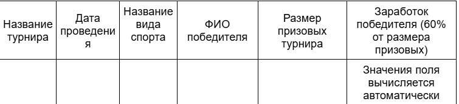
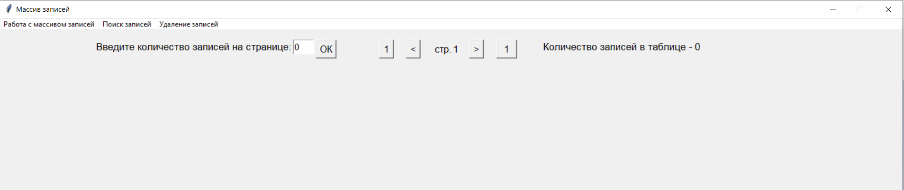
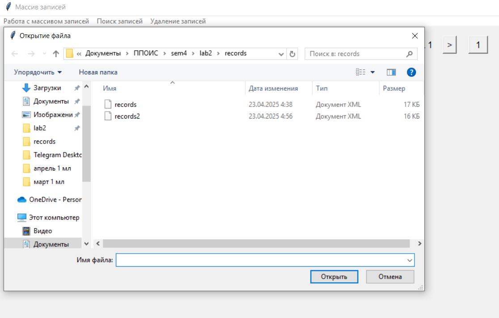
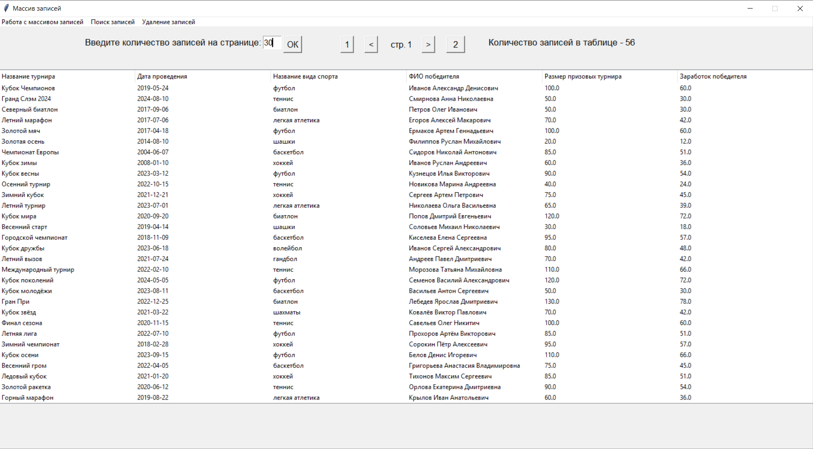
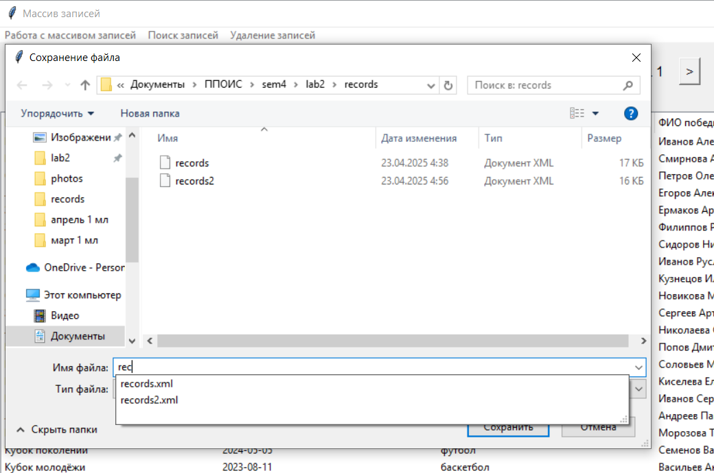
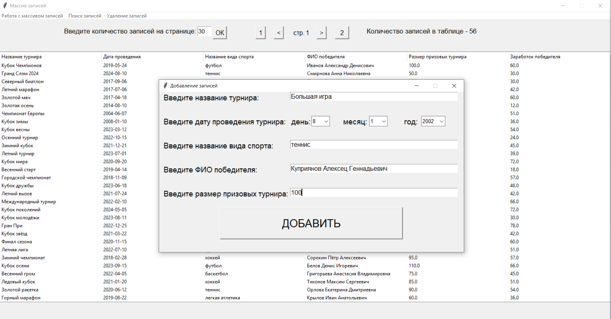
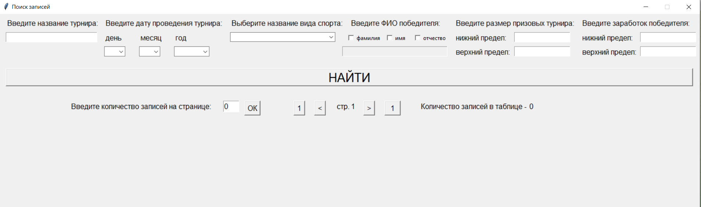
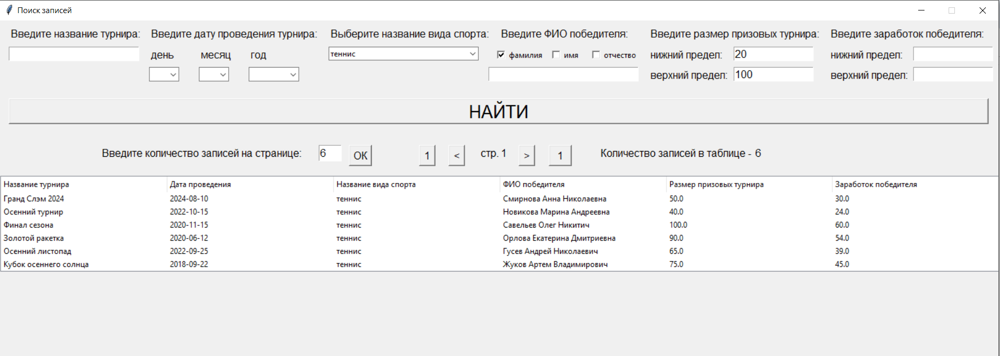

# GUI-приложение
Программная система представляет собой оконное приложение с одним главным окном и несколькими дочерними диалогами. Приложение позволяет формировать массив записей путем ввода записей через окно диалога, просмотреть записи в виде таблицы в главном окне, удалить записи в диалоговом окне, нацти записи в диалоговом окне, а также сохранить и загрузить записи.  
### Вид таблицы:  
  
## Демонстрация работы приложения 
### Главное окно:  
  
### Диалоговое окно загрузки файла:  
  
### Таблица с записями в главном окне:  
  
### Диалоговое окно сохранения файла:  
  
### Диалоговое окно добавления записей:  
  
### Диалоговое окно поиска записей:  
  
###  Таблица с записями в диалоговом окне поиска:  
  
### Диалоговое окно удаления записей:  
  
